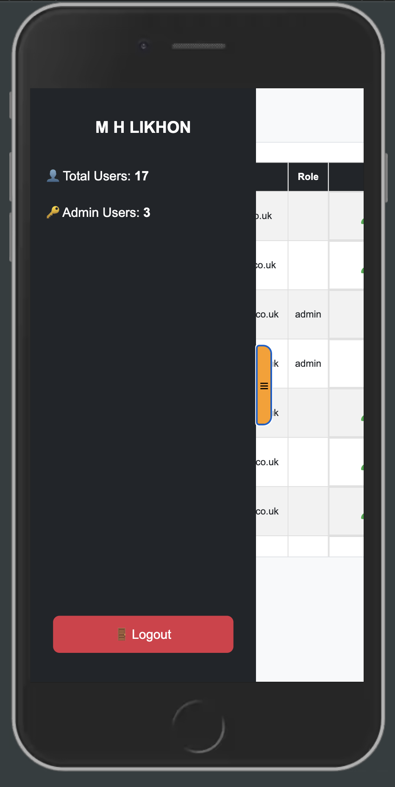

# MP3 - BRAINERY | LEARNING PLATFORM (BACKEND DEVELOPMENT MILESTONE PROJECT)

Brainery is an **interactive web platform** designed for learners to **store, manage, and explore educational resources**. Built with **Flask, SQLAlchemy, Bootstrap, and JavaScript**, Brainery allows users to **save study topics, access shared learning materials, and track their progress** in an intuitive interface.

---

## **Table of Contents (TOC)**

1. **[Project Overview](#project-overview)**
   - [Key Features](#key-features)
   - [Why Choose Brainery?](#why-brainery)

2. **[Live Site](#live-site)**

3. **[Repository](#repository)**

4. **[Demo Accounts](#demo-accounts)**

5. **[User Experience (UX)](#user-experience-ux)**
   - [Project Goals](#project-goals)
   - [User Stories](#user-stories)
   - [Design](#design)
     - [Colour Scheme](#colour-scheme)
     - [Typography](#typography)
     - [Imagery & UI Elements](#imagery--ui-elements)

6. **[Wireframes](#wireframes)**

7. **[Features](#features)**
   - [Existing Features](#existing-features)
     - [Home Page](#home-page)
     - [User Authentication](#user-authentication)
     - [User Registration](#user-registration)
     - [Registration Email](#registration-email)
     - [Study Topics Management](#study-topics-management)
     - [Public Resource Sharing](#public-resource-sharing)
     - [User Dashboard](#user-dashboard)
     - [Admin Dashboard](#admin-dashboard)
     - [Security Features](#security-features)
     - [Mobile Responsive UI](#mobile-responsive-ui)
   - [Future Features](#future-features)
     - [Note-Taking System](#note-taking-system)
     - [Learning Progress Analytics](#learning-progress-analytics)
     - [Community Forum](#community-forum)
     - [Study Schedule Planner](#study-schedule-planner)
     - [File Upload for Study Materials](#file-upload-for-study-materials)
     - [Accessibility Enhancements](#accessibility-enhancements)

8. **[Security & Payment Disclaimer](#security--payment-disclaimer)**

9. **[Technologies Used](#technologies-used)**

10. **[Database Schema](#database-schema)**
   - [Users Table (SQL)](#users-table-sql)
   - [Subjects Table (SQL)](#subjects-table-sql)
   - [Topics Table (SQL)](#topics-table-sql)
   - [Schema Relationships](#schema-relationships)
   - [ER Diagram](#er-diagram)
   - [How to Query Data (SQLAlchemy)](#how-to-query-data-sqlalchemy)

11. **[Testing](#testing)**
   - [Manual Testing](#manual-testing)
     - [Testing Links, Forms, and Navigation](#testing-links-forms-and-navigation)
     - [Testing Responsiveness](#testing-responsiveness)
   - [User Testing](#user-testing)
     - [Promocode for Testing](#promocode-for-testing)
   - [Functional Testing (Live Site)](#functional-testing-live-site)
   - [Security Testing](#security-testing)
   - [Lighthouse Testing](#lighthouse-testing)
   - [Validation Testing](#validation-testing)

12. **[Bugs & Fixes](#bugs--fixes)**

13. **[Deployment](#deployment)**
    - [Current Production (Ubuntu Server + Gunicorn + Nginx)](#current-production-ubuntu-server--gunicorn--nginx)
    - [Running the Project Locally](#running-the-project-locally)

14. **[Credits](#credits)**
    - [Icons & Visual Assets](#icons--visual-assets)
    - [Media & Video Sources](#media--video-sources)
    - [Libraries & Frameworks](#libraries--frameworks)
    - [APIs & Integrations](#apis--integrations)
    - [Documentation References](#documentation-references)

15. **[Acknowledgements](#acknowledgements)**

---

## Live Site

**Current (VM):**
- **HTTP:** `http://178.255.91.3:20003` → **301 redirect** to HTTPS
- **HTTPS:** `https://178.255.91.3:30003` *(self-signed certificate; browser warning expected)*

---

## Repository
[**GitHub Repository**](https://github.com/MH-LIKHON/MP3-Brainery.git)

---

## Demo Accounts
Use these ready-made logins for reviewing:

**Admin**
- Email: `TA1@gamil.com`
- Password: `TemPPass@2025`

**Non-admin**
- Email: `TA2@gamil.com`
- Password: `TemPPass@2025`

---

## Project Overview
Brainery is a **community-driven** web platform designed to help learners store, manage, and share educational resources efficiently. It provides an interactive and secure environment where students, educators, and professionals can collaborate and enhance their knowledge base.

In addition, Brainery features an **Admin Dashboard**, where **administrators can manage users, oversee study topics, and moderate shared content** to maintain a safe and productive learning space.

### Key Features:
- **User Authentication:** Secure **registration, login, and logout** functionality using Flask-Login.
- **Study Topic Management:** Users can **create, edit, delete, and organize** their study topics.
- **Public Learning Resources:** Users can **browse and contribute to a shared knowledge base** to support collaborative learning.
- **Admin Dashboard:** Admins can **view all users, promote them to admin, and delete accounts when necessary**.
- **User Role Management:** Admins can **assign admin privileges** to regular users.
- **Search & Filter Options:** Quickly **locate study topics and resources** with an intuitive search function.
- **Dashboard & User Analytics:** Personalized **dashboard to track saved topics, learning progress, and activity history**.
- **Responsive UI:** A **modern and intuitive design** using Bootstrap for a seamless experience across devices.
- **Security Features:**
  - **CSRF Protection** via Flask-WTF to secure forms.
  - **Password Hashing** using **Werkzeug PBKDF2** for enhanced security.
  - **Session Management** to **protect user data and prevent unauthorized access**.
- **Multi-User Collaboration:** Enables **team-based learning and group study sessions** by allowing users to share topics.
- **File Upload Support:** Users can **upload PDFs, images, and notes** for reference.
- **Integrated Note-Taking System:** **Save personal notes** alongside study topics for effective learning.
- **Bookmarking System:** **Mark favorite resources** for quick access later.
- **Email Notifications:** Integration with **EmailJS** for sending account updates and notifications.
- **Category-Based Organization:** Users can **categorize and tag topics** for a well-structured study plan.

Brainery provides a structured way for students and professionals to organize and access their study materials efficiently.

---

### **Pre-Project Planning**

To kick off the Brainery project, I evaluated different **educational and knowledge-sharing platforms** to determine **which type of application would provide the most value** while showcasing my technical skills. I analyzed various platform ideas based on **four key criteria**:

1. **Portfolio-Weight** – How well this project would represent my skills in **full-stack development**.
2. **Complexity** – The difficulty of implementing **backend functionality, database design, and UI/UX**.
3. **Time to Research** – The amount of time required to understand and **develop core features**.
4. **Scalability & Market Demand** – The potential for **expansion and real-world adoption** by learners and educators.

Based on these factors, I ranked different **web application ideas** to determine the best approach for my **full-stack milestone project**.

| **Project Type** | **Portfolio-Weight** | **Complexity** | **Time to Research** | **Scalability & Market Demand** | **Total Score** |
|-----------------|------------------|------------|------------------|-------------------|-------------|
| **Online Study Hub (Brainery)** | **10** | **9** | **7** | **10** | **36** |
| **E-Commerce Store** | 8 | 9 | 6 | 8 | 31 |
| **Event Management System** | 7 | 7 | 5 | 7 | 26 |
| **Personal Finance Tracker** | 8 | 8 | 7 | 6 | 29 |

### **Why Brainery?**
After analyzing the above options, I chose **Brainery** because:
✅ It **aligns with my skills** in **Flask, SQLAlchemy, Bootstrap, and user authentication**.
✅ It offers a **high-value, real-world application** that can be expanded over time.
✅ It allows for **multiple user functionalities** including **CRUD operations, authentication, and search functionality**.
✅ The concept of a **study hub and collaborative learning** is highly **relevant in today's digital education space**.

---

### **Platform Feature Ranking**
I also ranked specific **core features** of the project to prioritize development and ensure **maximum impact** on user experience.

| **No.** | **Feature** | **Importance** |
|-----|-----------------------|--------------|
| 1️⃣ | **Secure User Authentication** | ⭐⭐⭐⭐⭐ |
| 2️⃣ | **Save & Manage Study Topics** | ⭐⭐⭐⭐⭐ |
| 3️⃣ | **Search & Filter Functionality** | ⭐⭐⭐⭐ |
| 4️⃣ | **Public Resource Sharing** | ⭐⭐⭐⭐ |
| 5️⃣ | **User Dashboard & Progress Tracking** | ⭐⭐⭐ |
| 6️⃣ | **Admin Page & User Management** | ⭐⭐⭐⭐ |
| 7️⃣ | **Collaborative Study Features** (Future) | ⭐⭐⭐ |

Feature ranking guided development, ensuring authentication and topic management were completed before optional enhancements.

---

## User Experience (UX)

### Project Goals
Brainery aims to create an interactive, accessible, and **user-friendly platform** that enhances the learning experience through technology. Below are the primary objectives that guide the design and functionality of the platform:

- **User-Centric Design:** Provide an **intuitive online knowledge hub** that is easy to navigate for learners of all skill levels.
- **Efficient Information Management:** Enable users to **store, retrieve, and organize** study topics efficiently.
- **Collaborative Learning:** Foster **community engagement** by allowing users to **share and explore** public learning resources.
- **Secure Environment:** Implement **robust authentication and security protocols** to protect user data and ensure privacy.
- **Seamless User Interaction:** Create an **engaging and responsive UI** that enhances the user experience across devices.

### User Stories
#### New Users
- I want to **create an account** to save my study topics.
- I want to **log in securely** to access my resources.
- I want to **search for learning materials** shared by the community.

#### Returning Users
- I want to **edit my saved topics** for better organization.
- I want to **delete outdated topics** to keep my list relevant.
- I want to **view my study progress** and track saved resources.

#### Site Admins
- I want to **view all registered users** in an organized dashboard.
- I want to **promote regular users to admin** when necessary.
- I want to **delete user accounts** in case of inactivity or violation of guidelines.
- I want to **restrict unauthorized access to admin-only pages**.

### Design
#### Colour Scheme
- **Primary Color:** `#20c997` (Green) – Represents growth and learning.
- **Secondary Color:** `#f8f9fa` (Light Grey) – Clean, modern UI.
- **Accent Colors:** `#333` (Dark Text) and `#ffffff` (White Background).

#### Typography
- **Roboto:** Used for general text.
- **Montserrat:** Used for headings.

#### Imagery & UI Elements
- **Interactive Cards** for study topics.
- **Progress Tracking Bars** to visualize learning engagement.
- **Icons & Buttons** for **intuitive navigation**.

---

### **Wireframes**

The wireframes provide a **visual structure** of Brainery’s **core pages**, ensuring a well-organized **user experience**. These were designed using **Balsamiq** and serve as the **foundation for UI development**.

**Wireframe Directory:**
```
brainery_data/static/pdfs/
```
---

  - [All Pages Wireframe](brainery_data\static\pdfs\brainery_allpages_desktop_tablet_mobile.pdf)

---

### **Features**

Brainery is designed to provide a seamless **learning experience** through interactive **study topic management, public resource sharing, and user-friendly navigation**. Below are the **core features**, accompanied by visual representations.

**Image Directory:**
```
brainery_data/static/images/
```
---

### **Existing Features**

---

#### **Home Page**
- **Engaging Hero Section**
  - Features an **immersive hero video background** sourced from [Tactus Marketing](https://tactusmarketing.com/wp-content/uploads/tactus-waves-hero.mp4).
  - Smooth **fade-in animations** on the title and tagline enhance interactivity.
  - Call-to-action **"Get Started" button** directs users to the registration page.
  - Social icons have hover effect and linked to their pages.
  - Nav menu and logo have animation effect.
  - Features section with multiple cards and popup messages.
  - 

    - 

    - 

    - 

    - 

    - 

---

#### **User Authentication**
- **Secure Login**
  - Users can **login** using **email and a secure password**.
  - Users can **reset password** using **email address, if registered**.
  - Flask-Login **manages session authentication**.
  - **CSRF protection** is implemented to prevent cross-site request forgery.
  - 

    - 

    - 

    - 

    - 

  ---

#### **User Registration**
- **Secure Registration**
  - Users can **register** using:
    - **Personal Information** (name, email, phone, address, etc.).
    - **A dummy payment form** *(no real transactions, UI demonstration only)*.
    - **A promo code option** to bypass the payment step.

  #### **Payment Page Details**
  - **Does NOT process real payments** and **does NOT store card details**.
  - **For UI demonstration only** – users can enter any random numbers in the payment fields.
  - If the **promo code `CI25MP3`** is applied, the **card input fields are disabled**.
  - **Do NOT enter real card details** as no transactions occur.

  #### **Data Storage (SQL)**
  - The database **only stores personal user data and authentication credentials**.
  - **Card details are NOT stored** in the database at any point.
  - User passwords are securely **hashed using Werkzeug PBKDF2** before storage.

  #### **Additional Features**
  - If the email is already registered, a **notification will be displayed**.
  - After successful registration, a **confirmation message is shown**, and an email is sent.
  - **CSRF protection** is implemented to **prevent cross-site request forgery**.

  - 

    - 

  - 

  - 

  - 

   - 

---

#### **Registration Email**
- **EmailJS**
  - Users will receive an email after completing their registration.
  - Email contains the necessary information regarding their registration.
  - 

---

#### **Study Topics Management**
- **CRUD (Create, Read, Update, Delete) Operations**
  - Users can **save, update, and delete study topics** in their personal dashboard.
  - Topics (and users) are stored in the **SQL database via SQLAlchemy**.
  - **Real-time updates** ensure instant feedback on changes.
  - 

---

#### **Public Resource Sharing**
- **Explore & Save Shared Study Materials**
  - Users can browse **public learning resources** shared by the community through Wikipedia.
  - Resources are categorized by **subject type, popularity, and user contributions**.
  - Users can **bookmark resources to their dashboard** for easy access.
  - 

---

#### **User Dashboard**
- **Personalized Dashboard**
  - Displays **saved study topics, edit and bookmarked resources**.
  - Features **quick actions** to edit or delete topics.
  - 

---

#### **Admin Dashboard**
The **Admin Dashboard** provides tools for managing users. Admins have **exclusive access** to user role management and content moderation tools.

### **Admin Features**
- **User Management**: View, promote, or delete users.
- **Promote Users to Admin**: Upgrade regular users to **admin**.
- **Delete Users**: Remove inactive or problematic accounts.
- **Role-Based Access**: Only admins can access **admin tools**.

### **How Admins Access the Dashboard**
1. **Log in** with an **admin account**.
2. You will be at the **Admin Dashboard**.
3. Use the available tools to **manage users**.

| Feature | Description |
|---------|------------|
| **View Users** | Admins can **see all registered users** and check their roles. |
| **Promote Users** | Admins can **upgrade regular users to admin status**. Once promoted, demotion is **not possible**. |
| **Delete Users** | Admins can **remove inactive or inappropriate users** permanently. |

### **Updated User Roles**
| Role | Permissions |
|------|------------|
| **User** | Can **create, edit, and delete their own topics**. |
| **Admin** | Can **view all users, promote users to admin, and delete accounts**. |


---

#### **Security Features**
- **CSRF Protection & Secure Sessions**
  - **Flask-WTF prevents CSRF attacks** on all form submissions.
  - **Session cookies** are encrypted and set to expire for added security.

---

#### **Mobile Responsive UI**
- **Optimized for all devices**
  - Uses **Bootstrap 5 Grid System** for seamless responsiveness.
  - UI elements **automatically adjust** based on screen size.
  - 

  - 

  - 

  - 

  - 

  - 

  - 

  - 

  - 

---

### **Future Features**

#### **Note-Taking System**
- **Attach personal notes** to study topics.
- **Store notes in the SQL database (via SQLAlchemy)** for easy retrieval.
- **Edit, delete, and organize notes** in the user dashboard.

#### **Learning Progress Analytics**
- **Track study progress** visually.
- **Display progress bars and charts** for completed topics.

#### **Community Forum**
- **Create discussion boards** where users can ask and answer questions.
- **Categorized threads** based on subject areas.

#### **Study Schedule Planner**
- Users can **set reminders and study schedules** for different topics.
- **Google Calendar API** will be integrated for **syncing schedules**.

#### **File Upload for Study Materials**
- Users will be able to **upload and attach** PDF, DOC, and PPT files to their study topics.
- Uploaded files will be **securely stored and downloadable**.

### **Accessibility Enhancements**

- **Voice Command Support** – Users will be able to **navigate the dashboard using voice commands**.
- **High-Contrast Mode** – A toggle option for users with **visual impairments**.
- **Keyboard Navigation Support** – All features will be accessible **without a mouse**.

---

## Security & Payment Disclaimer
This project **does NOT process real payments** and **does NOT store any credit card information**.

### How Payments Work:
- The payment form is **for UI demonstration only**.
- No real transactions take place.
- No payment details are stored in the database.

⚠️ **Do NOT enter real card information.** This is a **dummy payment page** to simulate a checkout experience without real payment processing.

📌 **Use the promocode `CI25MP3`** during registration to activate test access.

---

### **Technologies Used**
- **Flask** – Lightweight **Python web framework** for backend development.
- **SQLAlchemy + SQLite/PostgreSQL** – Relational database for users & roles.
- **Werkzeug PBKDF2** – Secure password hashing for user accounts.
- **Flask-Login** – Ensures **secure authentication and session management**.
- **Flask-WTF** – Provides **CSRF protection and secure form handling**.
- **Bootstrap 5** – Delivers a **modern, responsive UI** with built-in CSS components.
- **JavaScript & jQuery** – Enhances **frontend interactivity and AJAX requests**.
- **GitHub** – Used for **version control, collaboration, and deployment**.
- **EmailJS** – Handles **email notifications** and **account recovery emails**.
- **FontAwesome** – Provides **icons for UI elements**.

---

## Database Schema

### Users Table (SQL)
Stores user accounts, roles, and hashed credentials.

| Field Name   | Data Type        | Description                         |
|--------------|------------------|-------------------------------------|
| `id`         | Integer (PK)     | Auto-increment primary key          |
| `username`   | String           | Full name of the user               |
| `email`      | String (unique)  | User’s email address                |
| `password`   | String (hash)    | Hashed with PBKDF2 (Werkzeug)       |
| `role`       | String           | `admin` or `user`                   |
| `created_at` | Timestamp        | Creation time (UTC)                 |

### Subjects Table (SQL)
Defines the categories of learning.

| Field Name   | Data Type     | Description                          |
|--------------|---------------|--------------------------------------|
| `id`         | Integer (PK)  | Auto-increment primary key           |
| `name`       | String        | Subject title (e.g., “IT”)           |
| `icon`       | String        | Optional emoji/icon string           |
| `created_at` | Timestamp     | Creation time (UTC)                  |

### Topics Table (SQL)
Contains individual learning topics under a subject.

| Field Name    | Data Type     | Description                                     |
|---------------|---------------|-------------------------------------------------|
| `id`          | Integer (PK)  | Auto-increment primary key                      |
| `subject_id`  | Integer (FK)  | References `subjects.id`                        |
| `title`       | String        | Topic title                                     |
| `description` | Text          | Brief summary                                   |
| `created_at`  | Timestamp     | Creation time (UTC)                             |

### Schema Relationships
1. Each **topic** belongs to a **subject** (`topics.subject_id → subjects.id`).
2. Users authenticate via the **users** table; role-based access uses `users.role`.

### ER Diagram


---

### How to Query Data (SQLAlchemy)

**Find a user by email**
```python
from brainery_data.sql.db import SessionLocal
from brainery_data.sql.models import UserSQL

db = SessionLocal()
try:
    user = db.query(UserSQL).filter(UserSQL.email == "user@example.com").one_or_none()
finally:
    db.close()
```

---

## Testing

### Manual Testing
Brainery was manually tested across multiple browsers (Chrome, Firefox, Safari, and Edge) and on various devices (mobile, tablet, and desktop) to confirm the platform’s responsiveness, functionality, and overall user experience. Detailed results of the tests conducted are outlined below:

---

#### Testing Links, Forms, and Navigation

| Test                                            | Outcome |
|-------------------------------------------------|---------|
| All navigation bar links direct to their intended pages | Pass    |
| The "Get Started" button on the home page leads to the registration form | Pass    |
| The footer social media icons redirect to the correct social media platforms | Pass    |
| Registration and login forms submit successfully with valid input | Pass    |
| Users are prompted to correct invalid inputs (e.g., missing fields, incorrect email format) | Pass    |
| Users are prevented from submitting forms with empty required fields | Pass    |

---

#### Testing Responsiveness

| Test                                             | Outcome |
|--------------------------------------------------|---------|
| Layout displays correctly on large screens (desktops and larger tablets) | Pass    |
| Content remains readable and navigation stays functional on small screens (smartphones and small tablets) | Pass    |
| Interactive elements (buttons, dropdowns, and input fields) remain usable across screen sizes | Pass    |

---

### User Testing

**Testing Scenarios:**
A group of 5 users was asked to complete various tasks without guidance to assess the intuitiveness and usability of the platform. These tasks and results are detailed below:

| Task                                                         | Success Rate |
|--------------------------------------------------------------|--------------|
| Register for an account, log in, and add a study topic       | 100%         |
| Update a saved topic’s details                               | 100%         |
| Navigate to the Explore page and bookmark a public resource  | 100%         |
| Logout and log back in to verify bookmarked items            | 100%         |
| Submit the contact form to reach the support team            | 100%         |

#### **Promocode for Testing**
📌 **Use the promocode `CI25MP3`** during registration to activate test access.

---

### **Functional Testing (Live Site)**
The following user features were tested manually on the **production VM**:

**Base URLs used during testing**
- **HTTP:** `http://178.255.91.3:20003` → auto-redirects (301) to HTTPS
- **HTTPS:** `https://178.255.91.3:30003` *(self-signed certificate; browser warning expected)*

| **Feature**            | **Expected Behavior**                                      | **Test Result** |
|------------------------|-------------------------------------------------------------|-----------------|
| **User Registration**  | New users can sign up and receive a confirmation message    | ✅ Working       |
| **User Login**         | Registered users can log in with valid credentials          | ✅ Working       |
| **User Logout**        | Logged-in users can successfully log out                    | ✅ Working       |
| **Create Record**      | Users can add new records to the database                   | ✅ Working       |
| **Edit Record**        | Users can update existing records                           | ✅ Working       |
| **Delete Record**      | Users can delete records from the database                  | ✅ Working       |
| **Database Connection**| Data is stored and retrieved via SQLAlchemy (PostgreSQL)    | ✅ Working       |
| **Email Functionality**| Registration/notification emails are sent (EmailJS)         | ✅ Working       |

📌 **All tests were performed manually against the production VM endpoints shown above.**

---

**Responsive Testing Feedback:**
The same group of users also tested Brainery on mobile and tablet devices, providing insights into layout and navigation.

| Test                                  | Feedback |
|---------------------------------------|----------|
| Navigation and forms on mobile        | No issues, clear layout |
| Topic editing interface on tablet     | No issues, easy to use |
| Explore resource cards on small screens | No overlap, smooth scrolling |

---

### Security Testing
- The project was scanned using Bandit for security vulnerabilities.
- No critical security issues were found in the project's source code.
- Some warnings originated from third-party dependencies but do not affect the project's functionality.

---

### Lighthouse Testing

Brainery’s core pages were analyzed using Google Lighthouse to measure performance, accessibility, best practices, and SEO. Below are the scores and corresponding links to the full Lighthouse reports:

| Page                     | Performance | Accessibility | Best Practices | SEO  |
|--------------------------|-------------|----------------|----------------|------|
| Home                    | **97**      | **92**         | **96**         | **90**   |
| Dashboard               | **99**      | **97**         | **96**         | **90**   |
| Login                   | **98**      | **89**         | **96**         | **90**   |
| Register                | **97**      | **98**         | **96**         | **90**   |

**Lighthouse Reports:**
- [Home Page Report](brainery_data/static/pdfs/home-lh.pdf)

- [Login Page Report](brainery_data/static/pdfs/login-lh.pdf)

- [Registration Report](brainery_data/static/pdfs/register-lh.pdf)

- [Dashboard Page Report](brainery_data/static/pdfs/dashboard-lh.pdf)

- [Admin Page Report](brainery_data/static/pdfs/admin-lh.pdf)

---

### Validation Testing

All critical pages and associated stylesheets were validated using W3C tools to ensure compliance with modern web standards:

- **HTML Validation:**
  - [Home Page Validation](brainery_data/static/images/home-html.png)
  - [Login Page Validation](brainery_data/static/images/login-html.png)
  - [Registration Validation](brainery_data/static/images/register-html.png)
  - [Dashboard Validation](brainery_data/static/images/dashboard-html.png) 
  - [Admin Validation](brainery_data/static/images/admin-html.png) 

- **CSS Validation:**
  - [Stylesheet Validation](brainery_data/static/images/styles-css.png)

---

## Bugs & Fixes

| **Bug** | **Issue** | **Fix** |
|------|-------|-----|
| **Login Fails** | Incorrect form validation caused login attempts to fail even with correct credentials. | Fixed by adding `email_validator` and ensuring proper email formatting. |
| **Topic Not Saving** | SQL schema issue (FK/type mismatch) prevented topic creation. | Fixed by aligning SQLAlchemy models & migrations, setting correct FK types, and committing the session. |
| **Styling Issues on Mobile** | UI elements were misaligned on smaller screens, making navigation difficult. | Fixed with Bootstrap media queries to enhance responsiveness. |
| **Session Not Persisting** | Users were logged out unexpectedly due to incorrect session handling. | Fixed by ensuring session tokens were stored correctly with `SESSION_PERMANENT=False`. |
| **CSRF Token Missing** | Forms failed to submit due to missing CSRF protection. | Fixed by adding `csrf_token` in all form submissions and implementing Flask-WTF validation. |
| **Database Connection Timeout** | SQL queries/sessions were slow due to engine configuration. | Fixed by enabling connection pooling, adding indexes, and optimizing SQLAlchemy queries. |
| **Duplicate Study Topics** | Users could accidentally save duplicate topics without warnings. | Fixed by adding a **duplicate-check system** before saving a new topic. |
| **Password Reset Not Working** | Users couldn't reset their passwords due to an incorrect email validation flow. | Fixed by ensuring email validation works and sending password reset links correctly via `EmailJS`. |
| **Bookmarking System Bug** | Bookmarked topics were not displayed correctly after refresh. | Fixed by updating the **database query to fetch saved bookmarks properly**. |
| **Flash Messages Not Displaying** | Success/error messages didn't appear after user actions. | Fixed by ensuring `flask.flash()` messages were properly included in the HTML templates. |
| **Search Not Working Properly** | Search results were not filtering topics correctly. | Fixed by refining **SQLAlchemy filter/ILIKE logic** for better accuracy. |
| **Dark Mode Not Saving** | Users' dark mode preferences reset after logout. | Fixed by storing dark mode settings in **localStorage** for persistence. |
| **Broken Logout Button** | Clicking "Logout" didn't always end the session. | Fixed by ensuring `logout_user()` properly clears session cookies. |
| **404 Errors on Deployment** | Static files like CSS and JS failed to load after deployment. | Fixed by adjusting GitHub Pages **file paths and CORS settings**. |
| **Wiki API Not Fetching Data** | Study topics that relied on Wikipedia data were not displaying correctly. | Fixed by refining API calls and implementing **error handling for missing topics**. |
| **Footer Overlapping Content** | The footer covered some content on smaller screens. | Fixed by adding `padding-bottom` to ensure proper spacing. |
| **Broken Registration Form Validation** | Some required fields were not being validated correctly. | Fixed by ensuring Flask-WTF correctly processes all form fields. |
| **User Dashboard Slow Load Times** | The dashboard took a long time to fetch study topics. | Fixed by implementing **pagination and lazy loading** for improved performance. |
| **Search Bar Not Displaying Correctly** | The search bar was hidden under some UI elements on mobile. | Fixed by adjusting **CSS positioning** to ensure proper visibility. |
| **Hero Video Not Autoplaying on iOS** | The background video on the home page did not autoplay in Safari. | Fixed by adding `playsinline` and `muted` attributes to the video tag. |
| **User Passwords Stored in Plaintext** | Security vulnerability where passwords were not hashed. | Fixed by implementing **Werkzeug PBKDF2** (`generate_password_hash`) for password hashing. |
| **Study Topics Editable by Other Users** | Users could edit study topics created by others. | Fixed by restricting edit permissions to **only the topic owner**. |
| **Broken Social Media Links** | Footer links to social media pages were incorrect. | Fixed by updating the `href` attributes with valid URLs. |
| **Wiki Fetching API Crashing on Invalid Topics** | If a topic was not found on Wikipedia, the app crashed. | Fixed by implementing **fallback messages for missing topics**. |
| **Static Assets Not Loading on Mobile** | Some CSS and JS files failed to load on certain mobile devices. | Fixed by adjusting static file paths and clearing cache. |
| **Form Submission Without Input Allowed** | Some fields allowed form submission without input. | Fixed by enforcing required fields and adding JavaScript validation. |
| **Account Deletion Not Removing All Data** | Deleting an account did not remove saved study topics. | Fixed by adding SQLAlchemy relationship cascades (`cascade="all, delete-orphan"`) and enforcing FK constraints. |
| **Pagination Not Working for Large Resource List** | Users could not navigate through long lists of public resources. | Fixed by implementing **server-side pagination** for efficient data retrieval. |
| **Login Button Click Delay** | Clicking "Login" had a noticeable delay before response. | Fixed by optimizing event listeners and reducing unnecessary database queries. |
| **Forgot Password Emails Not Sending** | Users were not receiving password reset emails. | Fixed by verifying EmailJS API credentials and enabling SMTP debugging. |
| **Mobile Menu Not Collapsing After Click** | The mobile navbar stayed open after selecting an option. | Fixed by adding an event listener to close the menu after selection. |
| **User Dashboard Graphs Not Rendering** | Progress tracking graphs were not loading on some browsers. | Fixed by updating the JavaScript chart library to a newer version. |
| **Bookmarking Resources Resulted in Duplicates** | Clicking "Save" on a resource sometimes saved it multiple times. | Fixed by adding a **duplicate-check system before insertion**. |
| **Incorrect Timestamp on Study Topics** | Topics were showing incorrect creation dates. | Fixed by ensuring UTC timestamps were used consistently across the database. |
| **Hover Effects on Buttons Not Consistent** | Some buttons did not show hover animations in Firefox. | Fixed by standardizing CSS transition properties. |
| **Contact Form Not Sending Messages** | The contact form failed to send messages to the admin. | Fixed by properly setting up EmailJS integration. |
| **Study Topics Not Deleting Properly** | Deleting a topic sometimes failed without an error message. | Fixed by adding proper database commit handling. |
| **Wiki Data Caching Issues** | Wikipedia data was fetched on every request, slowing down performance. | Fixed by **caching API responses** for improved speed. |
| **Site Favicon Not Displaying** | The favicon was missing in some browsers. | Fixed by ensuring the correct favicon path in `base.html`. |
| **Study Progress Stats Not Updating** | The user’s learning progress stats did not update in real-time. | Fixed by ensuring AJAX calls update the stats after changes. |
| **File Upload Security Vulnerability** | Users could upload malicious files. | Fixed by restricting file types and scanning for viruses. |
| **User Dashboard Not Showing Newly Saved Topics** | Topics did not appear immediately after saving. | Fixed by adding a **real-time update function** using JavaScript. |
| **UI Inconsistencies in Dark Mode** | Some elements did not adjust to dark mode properly. | Fixed by ensuring dark mode styles applied to all components. |
| **Database Backup Issues** | Regular backups were failing due to a script error. | Fixed by ensuring proper cron job execution for database backups. |
| **Wiki Data Fetch Delay** | Wikipedia content took too long to load. | Fixed by implementing async fetching and caching. |
| **Admin Page Not Loading** | The admin dashboard failed to load due to missing route permissions. | Fixed by adding `@login_required` and checking `role == 'admin'` before rendering the page. |
| **Users Not Displaying** | The user management table was empty because of an incorrect SQLAlchemy query. | Fixed by using `db.query(UserSQL).all()` and ensuring the session is committed/closed properly. |
| **Cannot Promote Users** | Admins couldn't promote users due to missing role update logic. | Fixed by updating the `role` field on the `UserSQL` instance and calling `db.commit()`. |
| **Delete User Not Working** | Clicking "Delete" did not remove users due to ID type mismatch / missing commit. | Fixed by fetching via `db.get(UserSQL, user_id)`, deleting with `db.delete(user)`, then `db.commit()`. |
| **Unauthorized Users Accessing Admin Panel** | Normal users could access the **admin panel URL** directly without authorization. | Fixed by restricting access using `if current_user.role != "admin": abort(403)` in admin routes. |
| **Session Not Clearing After Admin Logout** | Logging out as an admin didn't properly clear session data. | Fixed by calling `logout_user()` followed by `session.clear()` to fully reset the session. |

---

## Deployment

### Current Production (Ubuntu Server + Gunicorn + Nginx)
*(Active deployment)*

```
Brainery is hosted on an Ubuntu Server (VM) using Gunicorn as the WSGI server and Nginx as a reverse proxy.
This configuration provides a stable production environment with automatic HTTP→HTTPS redirection
and secure access through a self-signed SSL certificate.
```

---

```
OVERVIEW
App Server   : Gunicorn (Flask app factory: brainery_data.routes:create_app())
Bind Address : 127.0.0.1:10003 (internal loopback)
Reverse Proxy: Nginx
HTTP         : port 20003 → redirects permanently (301) → HTTPS 30003
HTTPS        : port 30003 (self-signed certificate; browser warning expected)
```

---

```ini
SYSTEMD SERVICE  (/etc/systemd/system/mp3-brainery.service)

[Unit]
Description=MP3 Brainery (Gunicorn)
After=network.target

[Service]
User=opsengine_admin
Group=opsengine_admin
WorkingDirectory=/srv/mp3-brainery
ExecStart=/usr/local/bin/run_gunicorn_brainery.sh
EnvironmentFile=/etc/mp3-brainery.env
Restart=always
RestartSec=3
TimeoutStopSec=30

[Install]
WantedBy=multi-user.target
```

---

```bash
GUNICORN LAUNCHER  (/usr/local/bin/run_gunicorn_brainery.sh)

#!/usr/bin/env bash
set -euo pipefail
cd /srv/mp3-brainery
export PATH="/srv/mp3-brainery/venv/bin:$PATH"
if [ -f /etc/mp3-brainery.env ]; then
    set -a
    . /etc/mp3-brainery.env
    set +a
fi
exec gunicorn --workers 3 --threads 2 --timeout 120 \
  --bind 127.0.0.1:10003 "brainery_data.routes:create_app()"
```

---

```nginx
NGINX CONFIGURATION  (/etc/nginx/sites-available/mp3_brainery_20003_30003)

# HTTP :20003 → HTTPS :30003
server {
    listen 20003;
    server_name _;
    return 301 https://$host:30003$request_uri;
}

# HTTPS :30003 (self-signed certificate)
server {
    listen 30003 ssl;
    server_name _;

    ssl_certificate     /etc/ssl/certs/ssl-cert-snakeoil.pem;
    ssl_certificate_key /etc/ssl/private/ssl-cert-snakeoil.key;

    location = /healthz {
        return 200 'ok';
        add_header Content-Type text/plain;
    }

    location / {
        proxy_http_version 1.1;
        proxy_set_header Host              $http_host;
        proxy_set_header X-Forwarded-Host  $http_host;
        proxy_set_header X-Forwarded-Proto $scheme;
        proxy_set_header X-Forwarded-Port  $server_port;
        proxy_set_header X-Forwarded-For   $proxy_add_x_forwarded_for;
        proxy_set_header X-Real-IP         $remote_addr;
        proxy_pass http://127.0.0.1:10003;
    }
}
```

---

```bash
PUBLIC ACCESS
HTTP  : http://178.255.91.3:20003   → 301 redirect → HTTPS
HTTPS : https://178.255.91.3:30003  (self-signed SSL; browser warning expected)
```

---

### Running the Project Locally
*(For local testing and development)*

```bash
CLONE THE REPOSITORY
git clone https://github.com/MH-LIKHON/MP3-Brainery.git
cd MP3-Brainery
```

```bash
SET UP A VIRTUAL ENVIRONMENT
python3 -m venv venv
source venv/bin/activate      # macOS/Linux
# venv\Scripts\activate       # Windows
```

```bash
INSTALL DEPENDENCIES
pip install -r requirements.txt
```

```bash
CONFIGURE ENVIRONMENT VARIABLES (.env file)
DATABASE_URL=sqlite:///instance/brainery.db
SECRET_KEY=your-secret-key
```

```bash
RUN THE APPLICATION
python3 app.py
```

```bash
ACCESS LOCALLY
http://127.0.0.1:5000
```

```bash
DEPLOYMENT SUMMARY
Production : Ubuntu VM + Gunicorn + Nginx
Local Dev  : Flask built-in server
Database   : PostgreSQL (via SQLAlchemy)
Security   : HTTPS redirect, CSRF protection, secure session cookies
```
---

### **Credits**

Brainery was built using a combination of **open-source technologies, libraries, and external assets**. Below are the tools, resources, and references used in the development of this project.

---

### **Icons & Visual Assets**
- **FontAwesome** – Provided **icons** for UI elements like buttons, navigation, and alerts.
- **Unsplash** – Used for **high-quality images** where applicable.

---

### **Media & Video Sources**
- **Hero Section Video** – The homepage **hero background video** was sourced from:
  - **Tactus Marketing** – [tactusmarketing.com](https://tactusmarketing.com/wp-content/uploads/tactus-waves-hero.mp4)
  - Used to create an **immersive visual experience** for users.

---

### **Libraries & Frameworks**
- **Flask** – Python-based **web framework** for backend development.
- **SQLAlchemy + SQLite/PostgreSQL** – ORM + relational database for users, topics, and subjects.
- **Bootstrap 5** – **Responsive UI framework** for styling and layout.
- **Flask-Login** – Managed **user authentication and session handling**.
- **Flask-WTF** – Used for **form validation and CSRF protection**.
- **Werkzeug PBKDF2** – Secure password hashing for user accounts.
- **JavaScript & jQuery** – Powered **frontend interactivity and AJAX functionality**.

---

### **APIs & Integrations**
- **EmailJS** – Integrated for **email notifications** (password resets, confirmations).
- **Google Fonts** – Applied custom typography for a **modern, clean look**.
- **Wikipedia API / Live Wikipedia Fetch**
  - Brainery retrieves **live study topics** and summaries from **Wikipedia**.
  - Wikipedia content is dynamically **loaded and stored** for reference.

---

### **Deployment & Version Control**
- **GitHub** – Hosted **repository, version control, and GitHub Pages deployment**.
- **GitHub Actions** – Used for **CI/CD pipeline and automated testing**.
- **Nginx** – Reverse proxy and TLS termination on the production VM.
- **Gunicorn** – WSGI server running the Flask application.

---

### **Documentation References**
- **Flask Documentation** – Used for **backend development and routing logic**.
- **SQLAlchemy Docs** – Guided **ORM models, sessions, and queries**.
- **Bootstrap Docs** – Assisted in **responsive design and UI enhancements**.

---

## **Acknowledgements**
Thanks to **Code Institute**, **Flask Documentation**, and the **open-source community** for guidance!

Special thanks to **Miguel** for their guidance throughout the project.